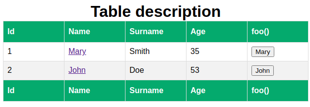

# Angular Content Projection Playground

[Check it out!](https://bugtamer.github.io/angular-content-projection-playground/) (non working link yet)

## Table Of Content

- [Original README.md](./angular.md)
- [Github pages](./github-pages.md)
- [Docker](./docker.md)
- [Usage](#usage)
  - [Table Component](#table-component) - ([README.md](./src/app/components/table/README.md))
    - [Browser's result](#browser_s-result)
    - [Angular template excerpt](#angular-template-excerpt)
    - [Angular classes](#angular-classes)
    - [Content Projection Resources](#content-projection-resources)

## Usage

### Table Component

- Angular 12 does not allow to use `select` attribute of `ng-content` dynamically ([1]).
- Implementation based on PrimeNG Table component (MIT License).
  - [PrimeNG Table component](https://www.primefaces.org/primeng/showcase/#/table/basic)
  - [github.com/primefaces/primeng](https://github.com/primefaces/primeng)
    - See [table.ts](https://github.com/primefaces/primeng/blob/master/src/app/components/table/table.ts) from PrimeNG.
      - See [`app.component.html`](./src/app/app.component.html) from this repo.
      - See [`app.component.ts`](./src/app/app.component.ts) from this repo.
    - See [shared.ts](https://github.com/primefaces/primeng/blob/master/src/app/components/api/shared.ts) from PrimeNG.
      - See [`injector.directive.ts`](./src/app/directives/injector/injector.directive.ts) from this repo.

#### Browser's result



#### Angular template excerpt

[`app.component.html`](./src/app/app.component.html)

The styles of this table are in [`table.component.css`](./src/app/components/table/table.component.css). ([2])

```html
<app-table [data]="employeeList">

  <ng-template appInjector="caption">Table description</ng-template>

  <ng-template appInjector="header">
    <th>Id</th>
    <th>Name</th>
    <th>Surname</th>
    <th>Age</th>
    <th>foo()</th>
  </ng-template>

  <ng-template appInjector="body" let-employee>
    <td>{{employee.id}}</td>
    <td>
      <a href="#">{{employee.name}}</a>
    </td>
    <td>{{employee.surname}}</td>
    <td>{{employee.age}}</td>
    <td>
      <button type="button" (click)="foo(employee)">{{employee.name}}</button>
    </td>
  </ng-template>

  <ng-template appInjector="footer">
    <th>Id</th>
    <th>Name</th>
    <th>Surname</th>
    <th>Age</th>
    <th>foo()</th>
  </ng-template>

</app-table>
```

#### Angular classes

[`app.component.ts`](./src/app/app.component.ts) (excerpt)

```typescript
···

employeeList = STAFF;

···
```

[`staff.stub.ts`](./src/app/models/staff.stub.ts)

```typescript
import { Employee } from './employee.model';

export const STAFF: Array<Employee> = [
  new Employee(1, 'Mary', 'Smith', 35),
  new Employee(2, 'John', 'Doe', 53),
];
```

[`employee.model.ts`](./src/app/models/employee.model.ts)

```typescript
export class Employee {

  constructor(
    public readonly id:      number,
    public readonly name:    string,
    public readonly surname: string,
    public readonly age:     number,
  ) {}

}
```
#### Content Projection Resources

- [ng-content select bound variable](https://stackoverflow.com/questions/37225722/ng-content-select-bound-variable) (2021-05-30)
- [Support for Dynamic Content Projection #8563](https://github.com/angular/angular/issues/8563) (2021-05-30)
- [How to style ng-content](https://stackoverflow.com/questions/41090302/how-to-style-ng-content#43211075) (2021-05-31)
- [Angular ng-content and Content Projection: A Complete Guide - How To Use ng-content To Improve Component API Design](https://blog.angular-university.io/angular-ng-content/) (2021-05-31)

[1]: https://stackoverflow.com/questions/37225722/ng-content-select-bound-variable "ng-content select bound variable"
[2]: https://stackoverflow.com/questions/41090302/ "How to style ng-content"
